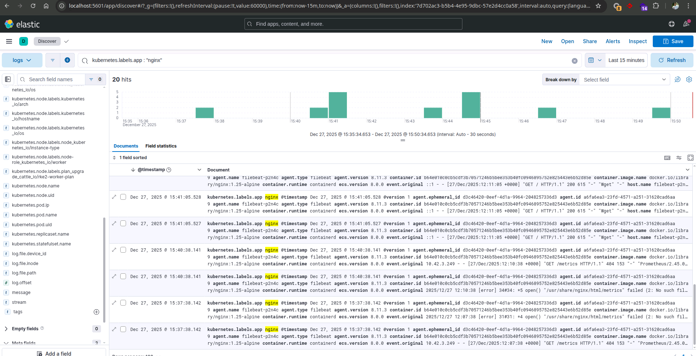

# ELK on Kubernetes (Practice Lab)

This repository deploys a minimal ELK stack (Elasticsearch, Logstash, Kibana) plus Filebeat and an nginx demo app on Kubernetes. It is designed for learning log collection, filtering, and Kibana discovery.




## Components

- Elasticsearch: single-node StatefulSet with Longhorn storage
- Logstash: Beats input, namespace filtering, nginx log parsing, storage-alert tag
- Kibana: UI for searching logs
- Filebeat: DaemonSet shipping container logs to Logstash
- Nginx demo app: generates HTTP logs for testing

## Files

- `00-namespaces.yaml` namespaces (`logging`, `demo`)
- `10-elasticsearch.yaml` Elasticsearch + Service
- `20-kibana.yaml` Kibana + Service
- `30-logstash.yaml` Logstash + pipeline config
- `40-filebeat.yaml` Filebeat DaemonSet + RBAC + config
- `50-nginx-demo.yaml` nginx Deployment + Service

## Deploy

```bash
kubectl apply -f k8s/00-namespaces.yaml
kubectl apply -f k8s/10-elasticsearch.yaml
kubectl apply -f k8s/30-logstash.yaml
kubectl apply -f k8s/20-kibana.yaml
kubectl apply -f k8s/40-filebeat.yaml
kubectl apply -f k8s/50-nginx-demo.yaml
```

## Generate Logs

```bash
kubectl -n demo exec deploy/nginx-demo -- sh -c "for i in 1 2 3 4 5; do wget -qO- http://localhost/ >/dev/null; done"
```

## Kibana Data View

1) Port-forward Kibana:
```bash
kubectl -n logging port-forward svc/kibana 5601:5601
```

2) Create a data view:
- Name: `logs`
- Index pattern: `logs-*`
- Timestamp field: `@timestamp`

3) Discover nginx logs (KQL):
- `kubernetes.labels.app : "nginx"`
- or `kubernetes.namespace : "demo"`

## Filters and Storage

- Filebeat and Logstash drop logs from namespaces not in the allowlist:
  `demo`, `logging`, `ingress-nginx`
- Logstash tags storage-related messages with `storage_full` and indexes them to:
  `alerts-storage-*`

## Troubleshooting

- No data view matches `logs-*`:
  - Check indices exist:
    ```bash
    kubectl -n logging port-forward svc/elasticsearch 9200:9200
    curl -s http://localhost:9200/_cat/indices?v | grep logs
    ```
  - Check Filebeat and Logstash logs:
    ```bash
    kubectl -n logging logs ds/filebeat --tail=50
    kubectl -n logging logs deploy/logstash --tail=50
    ```

## Notes

- Elasticsearch security is disabled for local practice.
- Storage uses the `longhorn` StorageClass with a 20Gi PVC.

## Screenshots

Place your screenshots in `docs/` using these filenames:
- `elk-manifests.png`
- `kibana-nginx.png`
